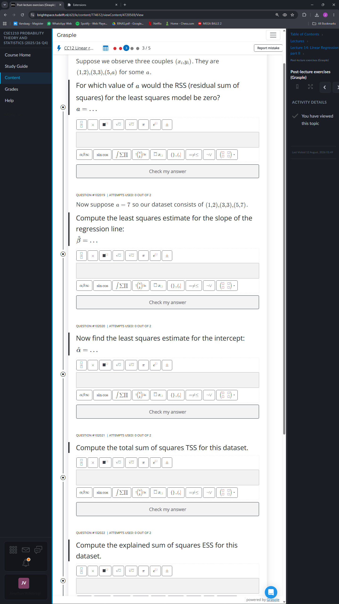
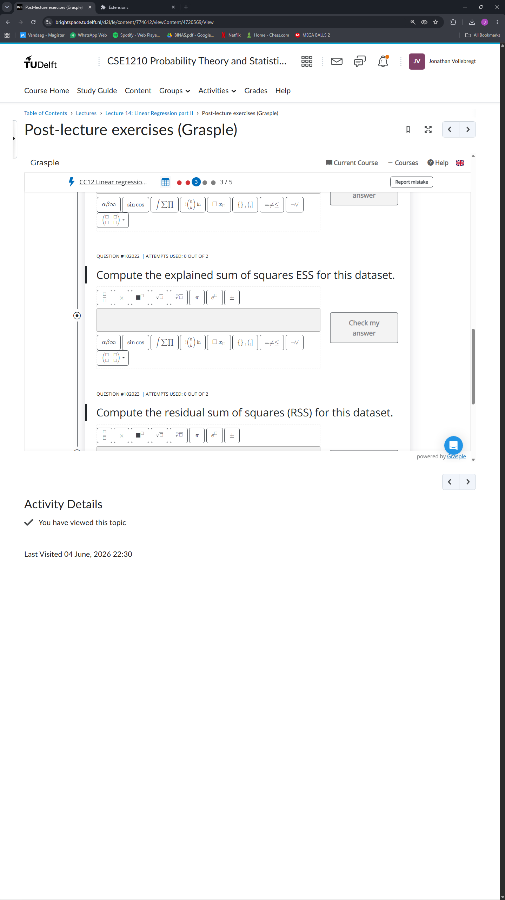

I made a firefox version because using chrome extensions on mobile is a mess:
https://addons.mozilla.org/en-GB/firefox/addon/brightspace-grasple-layout/

To install the chrome version, go to ```chrome://extensions``` and choose "Load Unpacked", then select the direct parent folder of all the files.

Here is an example of grasple inside of brightspace with and without the extension, on a vertically mounted 1440p screen.

 
